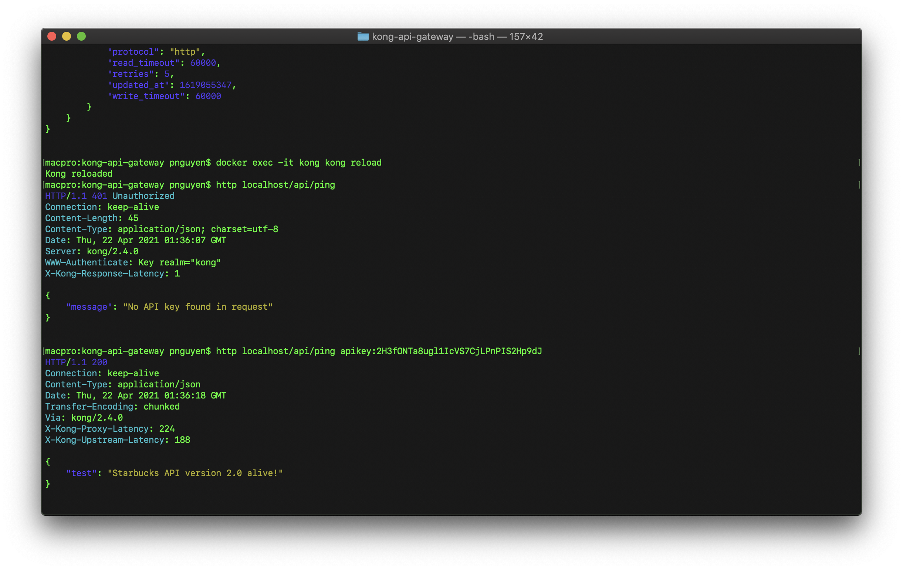
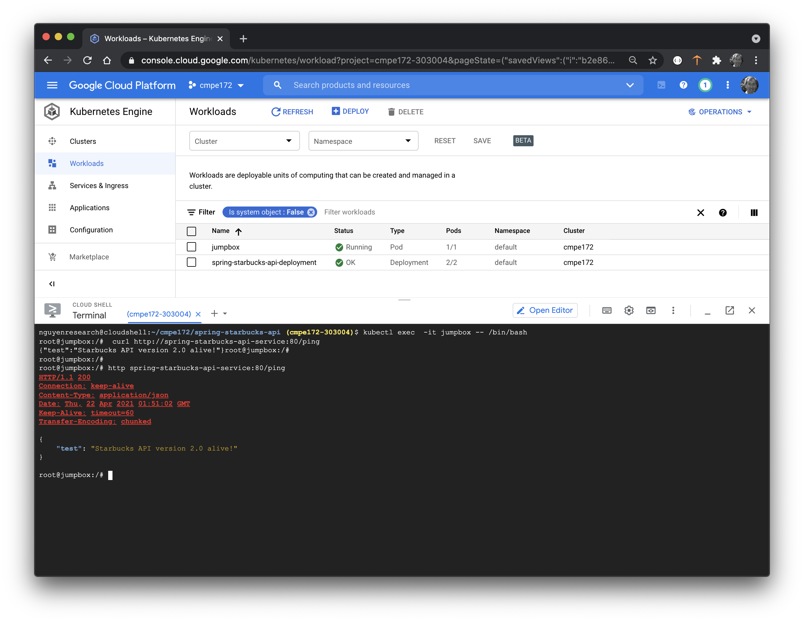
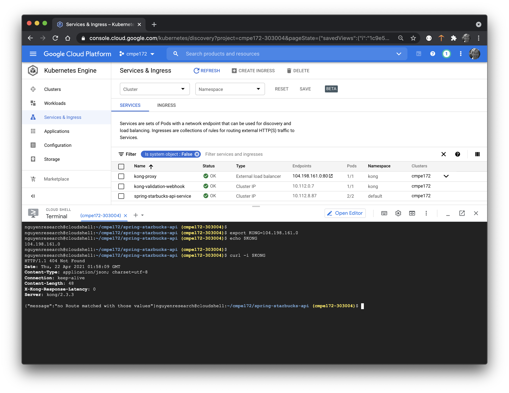
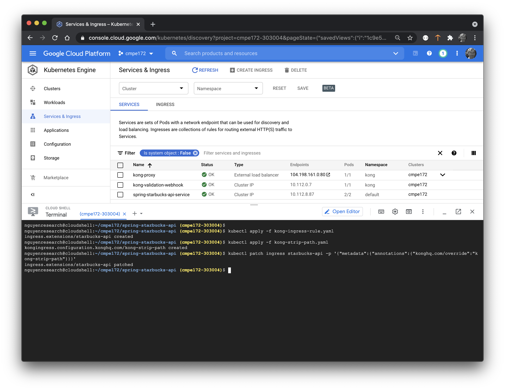
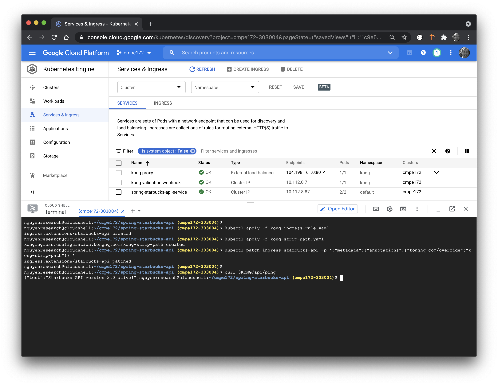

# CMPE 172 - Lab #8 - Kong API Gateway

* https://docs.konghq.com/getting-started-guide/2.4.x/overview/
* https://docs.konghq.com/gateway-oss/2.4.x/admin-api/

* Lab Files with Starter Code: https://github.com/paulnguyen/cmpe172/tree/main/labs/lab8

In this Lab, you will will be deploying Kong API Gateway to Google GKE and configuring the Gateway to route to your Starbucks REST API from Lab #6.
In addition, you will add API Key Authentication to your API and test your API via Postman.

Your work should be committed on a regular basis (each day you have a change) to your assigned GitHub Private Repo in the https://github.com/nguyensjsu organization. Your submission should include all the source code and notes on your work (including required screenshots) in README.md (GitHub Markdown).

In the /labs/lab8 folder, include
    images (screenshots)
    README.md (lab notes)


## Install Kong on Local Docker

* https://konghq.com/install
* https://hub.docker.com/_/kong

### Create Kong Docker Network

```
docker network create --driver bridge kong-network
docker network inspect kong-network
```

### Run Starbucks API in Docker

* Note: use your own Starbucks API Image

```
docker run -d --name starbucks-api --network kong-network -td spring-starbucks-api
```


### Run Kong Docker in DB-Less Mode

```
docker run -d --name kong \
--network=kong-network \
-e "KONG_DATABASE=off" \
-e "KONG_PROXY_ACCESS_LOG=/dev/stdout" \
-e "KONG_ADMIN_ACCESS_LOG=/dev/stdout" \
-e "KONG_PROXY_ERROR_LOG=/dev/stderr" \
-e "KONG_ADMIN_ERROR_LOG=/dev/stderr" \
-e "KONG_ADMIN_LISTEN=0.0.0.0:8001, 0.0.0.0:8444 ssl" \
-p 80:8000 \
-p 443:8443 \
-p 8001:8001 \
-p 8444:8444 \
kong:2.4.0
    
docker exec -it kong kong config init /home/kong/kong.yaml
docker exec -it kong cat /home/kong/kong.yaml >> kong.yaml

===== kong.yaml =====

_format_version: "1.1"

services:
- name: starbucks
  protocol: http
  host: starbucks-api
  port: 8080
  path: /
  plugins:
  - name: key-auth  
  routes:
  - name: api
    paths:
    - /api
    
consumers:
- username: apiclient
  keyauth_credentials:
  - key: 2H3fONTa8ugl1IcVS7CjLPnPIS2Hp9dJ

===== kong.yaml =====

http :8001/config config=@kong.yaml
docker exec -it kong kong reload

http localhost/api/ping
http localhost/api/ping apikey:2H3fONTa8ugl1IcVS7CjLPnPIS2Hp9dJ
```





## Deploy Kong on Google GKE


### Build and Push Your Starbucks API Docker Image to Docker Hub

* For Example:

```
docker login
docker build -t paulnguyen/spring-starbucks-api:v2.0 -t paulnguyen/spring-starbucks-api:v2.0 .
docker push paulnguyen/spring-starbucks-api:v2.0 
```

### Deploy Starbucks to GKE

```
kubectl create -f deployment.yaml 
```

* deployment.yaml (example)

```
apiVersion: apps/v1
kind: Deployment
metadata:
  name: spring-starbucks-api-deployment
  namespace: default
spec:
  selector:
    matchLabels:
      name: spring-starbucks-api
  replicas: 2 # tells deployment to run 2 pods matching the template
  template: # create pods using pod definition in this template
    metadata:
      # unlike pod.yaml, the name is not included in the meta data as a unique name is
      # generated from the deployment name
      labels:
        name: spring-starbucks-api
    spec:
      containers:
      - name: spring-starbucks-api
        image: paulnguyen/spring-starbucks-api:v2.0 
        ports:
        - containerPort: 8080
```


### Create a Service for Starbucks API

```
kubectl create -f service.yaml
```
* service.yaml (example)

```
apiVersion: v1
kind: Service
metadata:
  name: spring-starbucks-api-service 
  namespace: default
spec:
  type: ClusterIP
  ports:
  - port: 80
    targetPort: 8080 
  selector:
    name: spring-starbucks-api
```


### Test Reachability from GKE Jumbox Pod

```
kubectl create -f jumpbox.yaml
```

* jumpbox.yaml

```
apiVersion: v1
kind: Pod
metadata:
  name: jumpbox
spec:
  containers:
  - name: jumpbox
    image: ubuntu
    imagePullPolicy: Always
    command:
    - sleep
    - "3600"
```

```
kubectl exec  -it jumpbox -- /bin/bash
	
apt-get update
apt-get install curl -y
curl http://spring-starbucks-api-service:80/ping

{
    "test": "Starbucks API version 2.0 alive!"
}
```




### Install Kong GKE Ingress Controller

* https://hub.docker.com/_/kong
* https://github.com/Kong/kubernetes-ingress-controller
* https://docs.konghq.com/kubernetes-ingress-controller/1.2.x/guides/overview/
* https://docs.konghq.com/kubernetes-ingress-controller/1.2.x/guides/getting-started/

```
kubectl apply -f https://bit.ly/k4k8s
```

* Set PROXY_IP to Kong's Public IP

```
export KONG=35.184.121.226
echo $KONG
```

* Test Kong via Proxy IP.  Should get back "no route matched..."

```
curl -i $KONG
{"message":"no Route matched with those values"}
```





### Create an Ingress rule to proxy the Starbucks Service

* https://docs.konghq.com/kubernetes-ingress-controller/1.2.x/guides/using-kongingress-resource/

```
kubectl apply -f kong-ingress-rule.yaml
```

* kong-ingress-rule.yaml

```
apiVersion: extensions/v1beta1
kind: Ingress
metadata:
  name: starbucks-api
  annotations:
    kubernetes.io/ingress.class: kong
spec:
  rules:
  - http:
      paths:
      - path: /api
        backend:
          serviceName: spring-starbucks-api-service
          servicePort: 80
```

```
kubectl apply -f kong-strip-path.yaml
```

* kong-strip-path.yaml

```
apiVersion: configuration.konghq.com/v1
kind: KongIngress
metadata:
  name: kong-strip-path
route:
  methods:
  - GET
  - POST
  - PUT
  - DELETE
  strip_path: true
```

	
```
kubectl patch ingress starbucks-api -p '{"metadata":{"annotations":{"konghq.com/override":"kong-strip-path"}}}'
```




### Test Kong API Ping Endpoint

```
curl $KONG/api/ping
```


### Add Kong Key-Auth PlugIn 

* https://docs.konghq.com/kubernetes-ingress-controller/1.2.x/guides/using-kongplugin-resource/

``
 kubectl apply -f kong-key-auth.yaml
``

* kong-key-auth.yaml

```
apiVersion: configuration.konghq.com/v1
kind: KongPlugin
metadata:
  name: kong-key-auth
plugin: key-auth
```

```
kubectl patch service spring-starbucks-api-service -p '{"metadata":{"annotations":{"konghq.com/plugins":"kong-key-auth"}}}'
```


### Configure an API Client Key

* https://docs.konghq.com/kubernetes-ingress-controller/1.2.x/guides/using-consumer-credential-resource/

```
kubectl apply -f kong-consumer.yaml
```

* kong-consumer.yaml

```
apiVersion: configuration.konghq.com/v1
kind: KongConsumer
metadata:
  name: apiclient
  annotations:
    kubernetes.io/ingress.class: kong
username: apiclient
```


### Create Kubernetes Secret

* https://kubernetes.io/docs/concepts/configuration/secret/

```
 kubectl create secret generic apikey  \
  --from-literal=kongCredType=key-auth  \
  --from-literal=key=Zkfokey2311
```

### Apply API Key Credentials to API Client

```
kubectl apply -f kong-credentials.yaml
```

* kong-credentials.yaml

```
apiVersion: configuration.konghq.com/v1
kind: KongConsumer
metadata:
  name: apiclient
  annotations:
    kubernetes.io/ingress.class: kong
username: apiclient
credentials:
- apikey
```


### Test Your API Against Kong via Public IP of Load Balancer

* For Example:

```
export KONG=35.184.121.226
echo $KONG

curl $KONG/api/ping
curl $KONG/api/ping --header 'apikey: Zkfokey2311'

http $KONG/api/ping
http $KONG/api/ping apikey:Zkfokey2311
```


### Debugging Kong Ingress Controller

```
kubectl apply -f kong-ingress-controller.yaml

kubectl create -f jumpbox-kong.yaml
kubectl exec -n kong -it jumpbox-kong -- /bin/bash
apt-get update
apt-get install curl -y
curl kong-admin:8100/status


```


